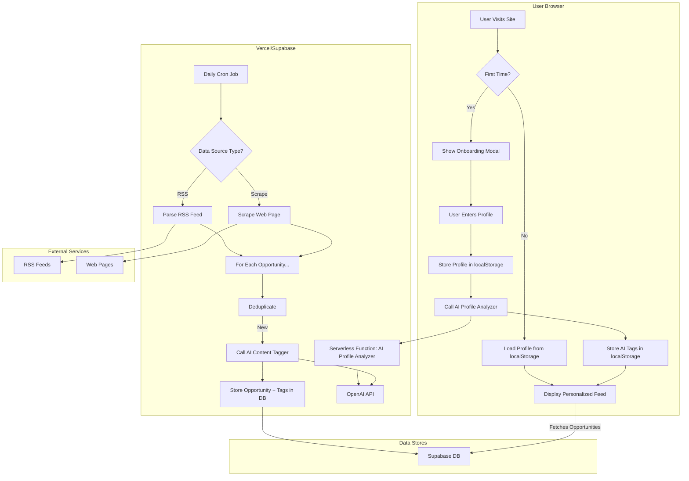

```mermaid
graph TD
    subgraph User Browser
        A[User Visits Site] --> B{First Time?};
        B -- Yes --> C[Show Onboarding Modal];
        C --> D[User Enters Profile];
        D --> E[Store Profile in localStorage];
        B -- No --> F[Load Profile from localStorage];
        E --> G[Call AI Profile Analyzer];
        F --> H[Display Personalized Feed];
        G --> I[Store AI Tags in localStorage];
        I --> H;
    end

    subgraph Backend [Vercel/Supabase]
        J[Daily Cron Job] --> K{Data Source Type?};
        K -- RSS --> L[Parse RSS Feed];
        K -- Scrape --> M[Scrape Web Page];
        L --> N[For Each Opportunity...];
        M --> N;
        N --> O[Deduplicate];
        O -- New --> P[Call AI Content Tagger];
        P --> Q[Store Opportunity + Tags in DB];
        G --> R[Serverless Function: AI Profile Analyzer];
        R --> S[OpenAI API];
        P --> S;
    end

    subgraph Data Stores
        T[Supabase DB]
        Q --> T;
        H -- Fetches Opportunities --> T;
    end

    subgraph External Services
        U[RSS Feeds];
        V[Web Pages];
        L --> U;
        M --> V;
        S;
    end
```